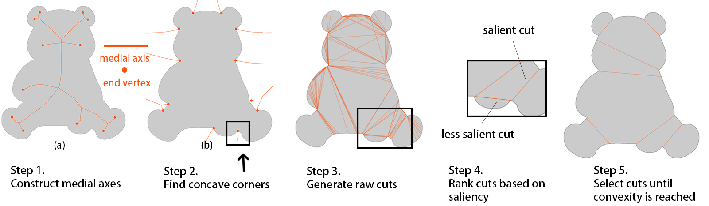
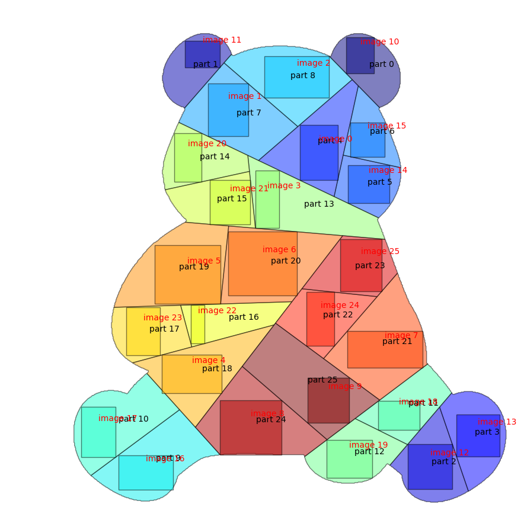

# Colla: Image Collage on Arbitrary Shape Layout


This is the official repo for the paper: **Image Collage on Arbitrary Shape via Shape-Aware Slicing and Optimization**.

The code has been tested on the following platform.


## Usage
1. Clone this repository
    ```
    git clone https://github.com/Dongee-W/Colla.git
    cd Colla
    ```
2. Install dependencies
    ```
    pip install -r requirements.txt
    ```
3. Run the code
    ```
    python run.py input_data/layout/baby.png input_data/image_collections/children_mask input_data/image_collections/children output_dir/baby 2
    ```
    The arguments are
    1. input shape
    2. input images foreground mask
    3. input images
    4. output directory
    5. scaling factor (The output resolution compared to the input shape size)

## User guide
The procedure consists of three main steps (and three corresponding python scripts).
### Step 1: Generate shape decomposition
The input shape is divided into convex parts based on the ideas illustrated in the following image. 


To run the code, execute `shape_decomposition.py` and specify two parameters: the path to the input layout image and the output directory.
```
python shape_decomposition.py input_data/layout/baby.png output_dir/baby
```
The code will output a json file `final_cut.json`, which contains the x,y-coordinates of the starting point and end point of all cuts. Format: 
```
[
    [[cut_1_start_x, cut_1_start_y]], [[cut_1_end_x, cut_1_end_y]], 
    [[cut_2_start_x, cut_2_start_y]], [[cut_2_end_x, cut_2_end_y]], 
    ....
]
```
Users can directly edit the file to adjust the result of the decomposition.


NOTE: `shape_decomposition.py` is our implementation of the paper: **Revisiting the medial axis for planar shape decomposition**. Some of the functionality is not supported. For example, the current code can not handle shapes with holes in it.

### Step 2: Shape-aware tree slicing and optimization
The optimal layout is generated by our tree-slicing and optimization algorithm.

To run the code, execute `sas_optimization.py` and specify three parameters: the path to input layout image, path the mask of the input image collection and the output directory.
```
python sas_optimization.py input_data/layout/baby.png input_data/image_collections/children_mask output_dir/baby
```
The output is a file `slicing_result.json` containing all the layout information, which looks something like this:

Each image is assigned to a part and the salient part of the image is contained in the rectangle.

### Step 3: Generate the final collage
Using the layout information generated in the previous step, the final collage is rendered.

Run `collage_assembly.py` with 3 parameters: input image collection, output directory and scaling factor. The scaling factor determines the resolution of the final collage (how many times the original shape resolution).
```
python collage_assembly.py input_data/image_collections/children output_dir/baby 2
```
The output collage


## Citation
```
@ARTICLE{10081386,
  author={Wu, Dong-Yi and Le, Thi-Ngoc-Hanh and Yao, Sheng-Yi and Lin, Yun-Chen and Lee, Tong-Yee},
  journal={IEEE Transactions on Visualization and Computer Graphics}, 
  title={Image Collage on Arbitrary Shape via Shape-Aware Slicing and Optimization}, 
  year={2023},
  volume={},
  number={},
  pages={1-13},
  doi={10.1109/TVCG.2023.3262039}}
```

## Contact
Email: cutechubbit@gmail.com

[Our Project Website](http://graphics.csie.ncku.edu.tw/shapedimagecollage/)